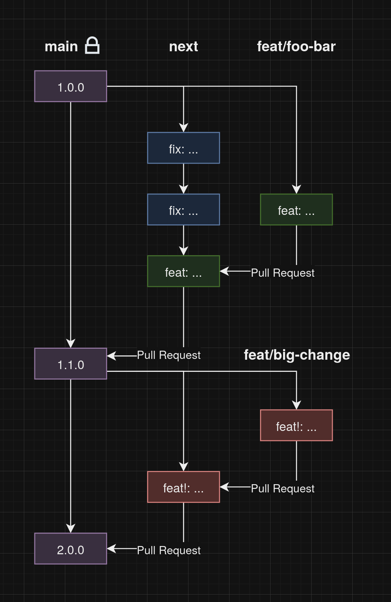

# Contributing Guidelines

## Commit Messages

This repository uses [Conventional Commits](https://www.conventionalcommits.org/en/v1.0.0/) and [commitlint](https://commitlint.js.org)
to standardize the commit messages.

## Development Flow

This repository follows a gitflow-style development.

The `main`/`master` branch is locked, and only allows pull requests.
Any change in the `main`/`master` branch gets automatically released via [semantic-release](https://github.com/semantic-release/semantic-release).

The `next` branch gets merged into `main`/`master` on an unscheduled basis.

Any change to the repository requires a new branch from the `next` branch, which then gets merged back into it with a pull request.

The pull request title must follow the same rules as commit messages and it gets linted.

The following diagram visualizes the development flow:

